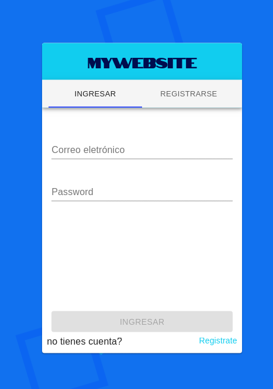

STORE MERN + DOCKER

## Available Scripts

clone repository
### `git clone`

install dependencies in the backend
### `cd api && npm i`

install dependencies in the frontend
### `cd app && npm i`

In the project directory, you can run:

### `docker-compose up -d`

Runs the frontend react js in the development mode. 
Open [http://localhost:3000](http://localhost:3000) to view it in the browser.

Runs the backend express in the development mode. 
Open [http://localhost:3001](http://localhost:3000) to view it in the browser.

Runs the database 
[mongodb://localhost:27018/api](mongodb://localhost:27018/api).
